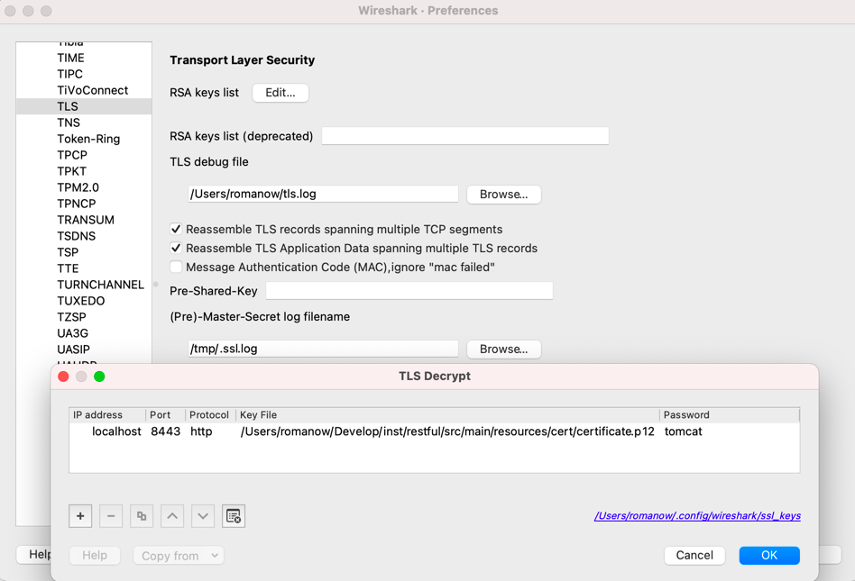

# RESTful

### SSL

Создание самоподписанного сертификата:

```shell
$ openssl req -newkey rsa:2048 -nodes -keyout key.pem -x509 -days 365 -out certificate.pem
$ openssl pkcs12 -inkey key.pem -in certificate.pem -export -out certificate.p12
```

```shell
$ curl https://localhost:8443/api/v1/servers -v -k | jq

* Connected to localhost (127.0.0.1) port 8443 (#0)
....
* SSL connection using TLSv1.2 / AES256-SHA
* ALPN: server did not agree on a protocol. Uses default.
* Server certificate:
*  subject: C=AM; ST=Yerevan; L=Yerevan; O=IT Enduro; CN=it-endu.ro
*  start date: Apr 24 21:02:18 2023 GMT
*  expire date: Apr 23 21:02:18 2024 GMT
*  issuer: C=AM; ST=Yerevan; L=Yerevan; O=IT Enduro; CN=it-endu.ro
*  SSL certificate verify result: self signed certificate (18), continuing anyway.
> GET /api/v1/servers/1 HTTP/1.1
> Host: localhost:8443
> User-Agent: curl/7.87.0
> Accept: */*
>
* Mark bundle as not supporting multiuse
< HTTP/1.1 200
< Content-Type: application/json
< Transfer-Encoding: chunked
< Date: Mon, 24 Apr 2023 21:03:38 GMT

* Connection #0 to host localhost left intact
{
  "id": 1,
  "purpose": "BACKEND",
  "latency": 10,
  "bandwidth": 10000,
  "state": {
    "id": 1,
    "city": "Moscow",
    "country": "Russia"
  }
}
```

### HTTP/2

```shell
* Connected to localhost (127.0.0.1) port 8080 (#0)
> GET /api/v1/servers/1 HTTP/1.1
> Host: localhost:8080
> User-Agent: curl/7.87.0
> Accept: */*
> Connection: Upgrade, HTTP2-Settings
> Upgrade: h2c
> HTTP2-Settings: AAMAAABkAAQCAAAAAAIAAAAA
>
* Mark bundle as not supporting multiuse
< HTTP/1.1 101
< Connection: Upgrade
< Upgrade: h2c
< Date: Mon, 24 Apr 2023 21:04:35 GMT
* Received 101, Switching to HTTP/2
* Using HTTP2, server supports multiplexing
* Copying HTTP/2 data in stream buffer to connection buffer after upgrade: len=0
< HTTP/2 200
< content-type: application/json
< date: Mon, 24 Apr 2023 21:04:35 GMT
<
* Connection #0 to host localhost left intact
{
  "id": 1,
  "purpose": "BACKEND",
  "latency": 10,
  "bandwidth": 10000,
  "state": {
    "id": 1,
    "city": "Moscow",
    "country": "Russia"
  }
}
```

### NGINX кэширование

Запустить два instance на разных портах:

```shell script
java -jar restful/build/libs/restful.jar --server.port=8081
java -jar restful/build/libs/restful.jar --server.port=8082
```

Конфигурация nginx:

```
upstream backend {
  server 127.0.0.1:8081 max_fails=3 weight=5;
  server 127.0.0.1:8082 backup;
}

server {
  listen 80;
  server_name *;

  location / {
    proxy_set_header Host $host;
    proxy_set_header X-Real-IP $remote_addr;
    proxy_pass http://backend;
    proxy_redirect off;
  }
}
```

### NGINX балансировка

Конфигурация nginx:

```
proxy_cache_path /var/cache/nginx levels=1:2 keys_zone=STATIC:32m max_size=1g;

server {
  listen 80;
  server_name *;

  location / {
    proxy_cache STATIC;
    proxy_cache_valid any 48h;
    add_header X-Cached $upstream_cache_status;

    proxy_set_header Host $host;
    proxy_set_header X-Real-IP $remote_addr;
    proxy_pass http://127.0.0.1:8080;
    proxy_redirect off;
  }
}
```

Два раза выполнить запрос через curl:

```shell script
curl http://localhost/api/v1/servers/1 -v
```

Второй раз в ответ получим заголовок `X-Cached: HIT`, т.е. сервер ответил 302, а тело запроса nginx достал из кэша.  
Для метода `http://localhost:8880/api/v1/servers` мы отдаем заголовок `Cache-Control: 60` (повторно выполнить запрос
через 1 минуту) и `ETag`, на базе которого строится кэширование.

Для запроса `http://localhost:8880/api/v1/servers/1` устанавливается заголовок `Cache-Control: no-cahce`, который
указывает промежуточным прокси, что запрос нельзя кэшировать, а нужно перезапрашивать каждый раз.

### Расшифровка HTTPS

Для расшифровки HTTPS требуется секретный ключ сервера. Запустим проект с профилем `local`, `tomcat`:

```shell
docker compose up -d
./gradlew clean build bootRun --args='--spring.profiles.active=local,tomcat'
```

В этой конфигурации задан chipper `TLS_RSA_WITH_AES_256_CBC_SHA`, который для расшифровки требует только ключ
сервера.

Для настройки Wireshark нужно открыть `properties` -> `protocols` -> `TLS` -> `RSA key list` с настройками:

* ip: `127.0.0.1`;
* port: `8443`;
* protocol: `http`;
* keyfile: `resources/certificate.p12`;
* password: `tomcat`.

Так же имеет смысл включить SSL debug file.



В случае ошибки _ssl_restore_master_key can't find pre-master secret by Encrypted pre-master secret_, значит при обмене
ключами используется алгоритм Диффи-Хеллмана, которому для расшифровки требуется не только ключ сервера, но и сессионные
ключи. Для этого нужно через переменную среды `SSLKEYLOGFILE` указать путь к файлу, куда будут записываться pre-master
ключи.

```shell
SSLKEYLOGFILE=/tmp/.ssl.log curl https://localhost:8443/api/v1/state -k
```